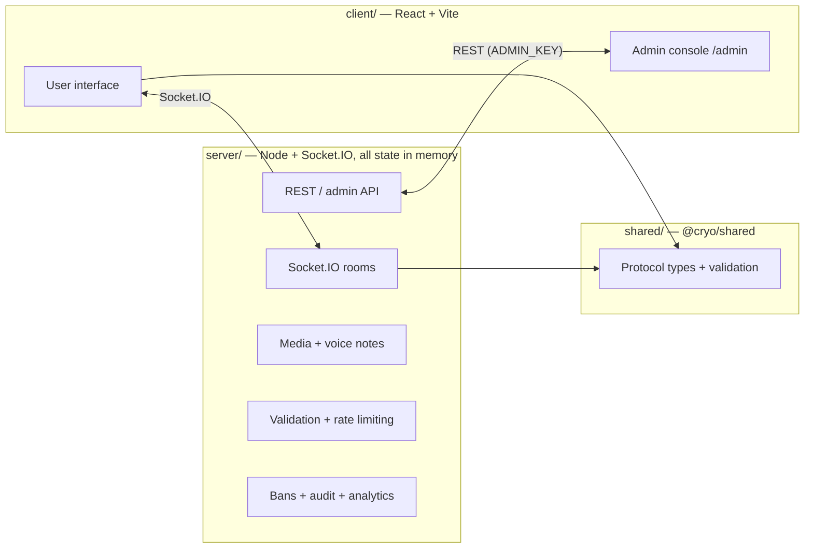

# Cryo Chat


Anonymous, ephemeral, real-time chat. No accounts, no database, no history — you
hop in, talk, bounce, and the room melts away on its own.

## What it does

- **No login, ever.** Open a link (or type a 4-digit code), type a name (or don't), you're in.
- **Rooms self-destruct.** Chats expire when they go quiet and get wiped by a timer. There is no database.
- **Share by code or link.** Every room has a short code — send it to a friend and they jump straight in.
- **Real-time everything.** Socket.IO (WebSockets) for messages, presence, and join/leave. Live.
- **Read receipts.** ✓ = sent. ✓✓ = someone else is in the room and saw it.
- **Live presence.** Participant count and who's around, right in the header.
- **Recent rooms.** Jump back into places you've visited, with a live "expires in…" countdown.
- **Rich messages.** Emoji picker with recents, WhatsApp-style large emoji, image upload, stickers, and reply quotes.
- **Voice notes.** Record and send audio that plays back in the room.
- **Moderation.** An admin console (`/admin`) with live rooms, users, audit trail, analytics, and settings you can turn on/off live.


---

## Architecture

Three npm workspaces, one single-page app, one persistent server.



- **`client/`** — React 18 + Vite 6 + TypeScript + Tailwind. A chat app and a
  separate admin console behind `/admin` (gated by `ADMIN_KEY`).
- **`server/`** — Node + Express + Socket.IO. Holds **everything in memory**:
  rooms, messages, presence, media, bans. Built to a single `server/dist/index.mjs`
  bundle that also serves the built frontend, so the whole app runs on one process.
- **`shared/`** — the protocol types and validation both sides use, so the wire
  contract can't drift.

The backend **must** run as a persistent process — socket rooms and in-memory
state can't survive serverless cold starts. There is no database; that's what
makes it fast and truly temporary.

---

## Getting started

```bash
npm install          # install everything (workspaces share one lockfile)
npm run dev          # server on :3000 + client (Vite) side by side
npm test             # 148 unit + integration tests
npm run typecheck    # tsc across all workspaces
npm run build        # client/ → dist, server/ → dist/index.mjs
```

Point the client at a running server with `VITE_SERVER_URL`, and the server at
the client with `CORS_ORIGIN`. See [`OVERVIEW.md`](OVERVIEW.md) for a deeper
walkthrough and [`DEPLOYMENT.md`](DEPLOYMENT.md) for hosting.

## Deployment

The full guide is in [`DEPLOYMENT.md`](DEPLOYMENT.md). Quick version:

- **Easiest:** one app serving both frontend and backend. Root `./`, build `npm install && npm run build`, start `npm start`.
- **Alternative:** frontend on **Vercel** (`client/` folder), backend on a persistent host, bridged with `VITE_SERVER_URL` + `CORS_ORIGIN`.

## CI

GitHub Actions runs on every push and PR: install → typecheck → build →
`npm test` (unit + a full-stack suite that boots the compiled server bundle) →
a smoke e2e of the admin API. Vercel preview builds exclude test files via
`client/tsconfig.build.json` and pin Node 22 via `client/.nvmrc`.

## Stack

- **Frontend:** React 18, Vite 6, TypeScript, Tailwind
- **Backend:** Node, Express 4, Socket.IO 4 (esbuild-bundled)
- **Tooling:** npm workspaces, Vitest 5, GitHub Actions, tsx, concurrently
- **Hosting:** a persistent host (and Vercel if you split the frontend)

---

## Privacy matters

- No accounts, no email, no tracking. Your name is just text you type in your browser — nothing is stored.
- Everything lives in server memory and is swept away by a timer. No database to leak.
- Rooms and messages auto-expire. Old chats don't hang around.

The honest trade-off: it's not for things you need to keep. It's for the here-and-now.

## Quick FAQ

**Will you save my messages?**
No. In-memory only, pruned by a timer. Nothing touches a disk database.

**Why did my room vanish?**
Rooms expire after being quiet for a bit (longer while people are in them). That's the point — it's ephemeral.

**What do the ticks mean?**
✓ = sent. ✓✓ = someone else is around and has seen it.