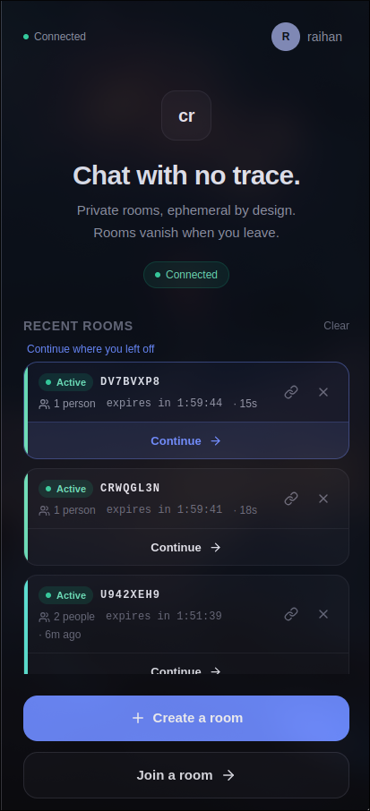
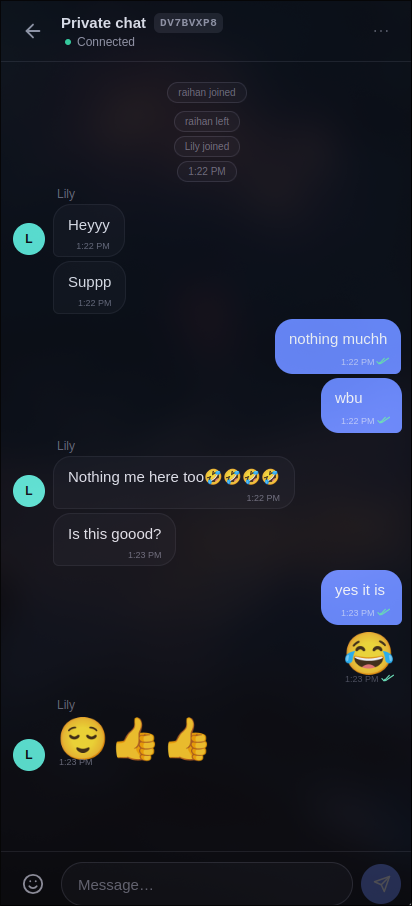

# Cryo Chat 👋

An anonymous, **ephemeral** chat. No accounts, no history, no drama. You hop in, talk, bounce. The chats literally melt away after a while.

Basically a chat that's built to vanish. 🧊

---

## ✨ What it can do

- **No login, ever.** Open a link, type a name (or don't), and you're in.
- **Rooms self-destruct.** Chats and rooms expire on their own and get wiped. Nothing is saved to a database.
- **Share by code or link.** Every room has a short code. Send it to a friend, they're in.
- **Real-time everything.** WebSockets (Socket.IO) — messages, who's online, join/leave. All live.
- **Read receipts.** A ✓ = sent. A ✓✓ = someone else is in the room and saw it.
- **See who's around.** Live participant count right in the header.
- **Recent rooms.** Jump back into places you visited, with a live "expires in…" countdown.
- **Emoji picker.** Instagram-style, with categories and your recent emoji.
- **Big emoji messages.** Send just an emoji and it shows up big, no bubble — WhatsApp style.

---

## 📸 Screenshots





---

## 🚀 Run it locally

```bash
npm install
npm run dev
```

That starts everything (workspaces):

- Frontend: http://localhost:5173
- Backend health check: http://localhost:4000/health

### What's in the box

| Part      | Folder     | What it is                         |
| --------- | ---------- | ---------------------------------- |
| frontend  | `client/`  | React + Vite + Tailwind            |
| backend   | `server/`  | Node + Express + Socket.IO         |
| shared    | `shared/`  | types both sides use, so they never drift |

---

## 🏗️ How it's put together

```
 ┌───────────────┐   Socket.IO (WebSocket)    ┌──────────────────┐
 │   Frontend    │ ─────────────────────────▶ │      Backend     │
 │  React + Vite │                            │ Node + Socket.IO │
 └───────────────┘                            └──────────────────┘
                                                      │
                                        All state in memory
                                   (rooms, messages, presence)
```

The backend holds everything **in memory** — there's no database. That's what makes it fast, simple, and truly temporary.

Because sockets + in-memory rooms need a **persistent** process, the backend runs on **Abasthan** (not serverless). In the usual setup, the backend also serves the built frontend, so the whole thing lives on one URL. Details in [`DEPLOYMENT.md`](DEPLOYMENT.md).

---

## 📦 Deployment

The full guide is in [`DEPLOYMENT.md`](DEPLOYMENT.md). Quick version:

- **Easiest:** one **Abasthan** app serving both frontend + backend. Root `./`, build `npm install && npm run build`, start `npm start`.
- **Alternative:** frontend on **Vercel** (`client/` folder), backend on **Abasthan**, connected with `VITE_SERVER_URL` + `CORS_ORIGIN`.

Both already work out of the box.

---

## 🔐 The privacy bit

- No accounts, no email, no tracking. Your name is just something you type in your browser — not stored anywhere.
- Everything lives in server memory and gets swept away by a timer. No database, nothing to leak.
- Rooms and messages auto-expire. Old chats don't hang around.

The trade-off, honestly: it's not for stuff you need to keep. It's for the here-and-now.

---

## 🛠️ Stack

- **Frontend:** React 18, Vite 6, TypeScript, Tailwind
- **Backend:** Node, Express 4, Socket.IO 4
- **Tooling:** npm workspaces, tsx, concurrently
- **Hosting:** Abasthan (and Vercel if you split it)

---

## ❓ Quick FAQ

**Will you save my messages?**
Nope. In-memory only, pruned by a timer. Nothing hits a disk database.

**Why did my room vanish?**
Rooms expire after being quiet for a bit (longer while people are in them). That's the whole point — it's ephemeral.

**What do the ticks mean?**
✓ = sent. ✓✓ = someone else is around and has seen it.

**Can I use my own domain?**
Yeah — Abasthan does custom domains with SSL, even on the free plan.
